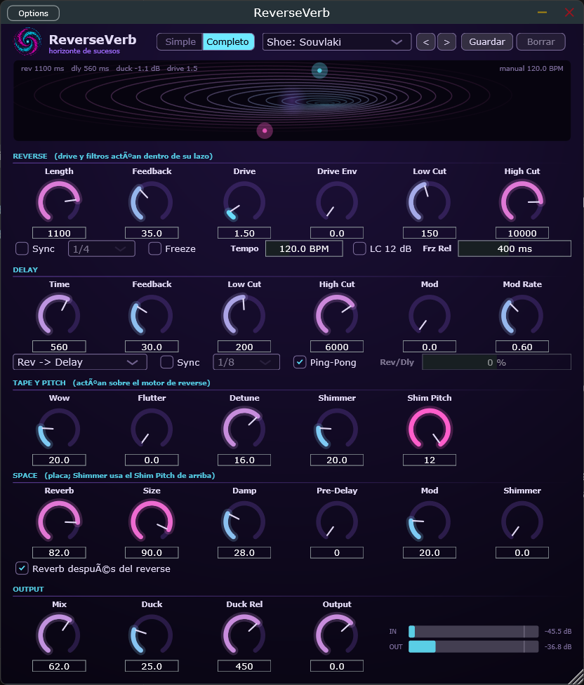

*English · [Español](README-es.md)*

**Reverse delay + delay + plate reverb for guitar and anything else.**
VST3 plugin for Windows, with a Standalone build so you can try it without a
DAW.


You play a note and, a moment later, you hear it grow backwards: from nothing
up to the attack. That reversed *swell* is the core. On top of it you can add
a rhythmic delay, a plate reverb with shimmer, tape texture (wow, flutter,
detune), stacked octaves, and a ducker that moves the tail out of the way
while you're playing so it never buries you.

> If you're here to **develop** the plugin (full build details, tests, how the
> DSP works inside), all of that lives in [TECHNICAL.md](TECHNICAL.md). This
> file is about **using** it.

---

## Contents

1. [Installation](#installation)
2. [The first five minutes](#the-first-five-minutes)
3. [The controls](#the-controls)
4. [Presets](#presets)
5. [Where it goes in your chain](#where-it-goes-in-your-chain)
6. [The display](#the-display)
7. [MIDI control](#midi-control)
8. [Tips and things worth knowing](#tips-and-things-worth-knowing)
9. [Troubleshooting](#troubleshooting)

---

## Installation

**The interface speaks your language:** the plugin shows up in Spanish if your
system is set to Spanish, and in English otherwise. Control names (Length,
Feedback, Drive…) are the same in both.

**If there's a published version** under
[Releases](https://github.com/cypherfunk-dev/ReverseVerb/releases), download
the zip for your system, unzip it and skip to
[Loading it in Ableton Live](#loading-it-in-ableton-live) (pointing at the
folder where you put the `.vst3`), or open the Standalone directly.

**Otherwise**, build it from source. You only need to do this once.

**You need:** Visual Studio (the free Community edition is fine) with the
*"Desktop development with C++"* workload selected during install, and Git.

1. Open the **Developer Command Prompt for VS** (search for it in the Start
   menu).
2. Download the project and build it:

```bat
git clone https://github.com/cypherfunk-dev/ReverseVerb.git
cd ReverseVerb
cmake -B build
cmake --build build --config Release
```

The first time takes several minutes because it downloads JUCE (about
500 MB). Later builds are fast.

When it finishes you'll have two things:

| What | Where |
|---|---|
| The **VST3** plugin | `build\ReverseVerb_artefacts\Release\VST3\ReverseVerb.vst3` |
| The **Standalone** build (no DAW) | `build\ReverseVerb_artefacts\Release\Standalone\ReverseVerb.exe` |

### Trying it without a DAW

Open the `ReverseVerb.exe` above, go to **Options → Audio Settings**, pick your
audio interface, and it plays. It's the fastest way to try the effect and mess
with the presets.

### Loading it in Ableton Live

The plugin **doesn't copy itself** to the system folder; instead you tell
Ableton to read it from where it was built:

1. **Preferences** (`Ctrl+,`) → **Plug-Ins** tab.
2. Enable **"Use VST3 Plug-In Custom Folder"**.
3. **Browse** → pick the folder
   `...\ReverseVerb\build\ReverseVerb_artefacts\Release\VST3`
   (the **folder**, not the `.vst3` file).
4. Press **Rescan**.

In other DAWs it's the same: add that folder to the VST3 paths and rescan.

If you'd rather have it in the standard folder, copy `ReverseVerb.vst3` to
`C:\Program Files\Common Files\VST3` (it will ask for admin rights).

---

## The first five minutes

The plugin opens in **Simple mode**: eight large controls, the ones that
define the sound. Everything else is in **Full** (the switch at the top, next
to the preset). Switching modes doesn't touch the sound: what you don't see
keeps working, and the lines at the bottom tell you what's there ("Tape · Wow
18 · Detune 6 c"). Clicking them takes you to Full. The mode is remembered
between sessions.

1. Load the plugin on a guitar track (or whatever).
2. Pick the **Swell clasico** preset from the dropdown at the top.
3. Play a single note and let it ring. You'll hear it reappear reversed a
   moment later.
4. Turn **Length**: it's the size of the "chunk" that gets reversed. Short
   (100 ms) sounds granular and nervous; long (1 s or more) is the ambient
   swell.
5. Raise **Mix** to hear more effect and less direct guitar.
6. If the tail buries you on fast phrases, raise **Duck**: the effect steps
   aside while you play and grows in the gaps.

That's 80 % of the plugin. The rest is colour.

---

## The controls

In **Simple** you see eight: `Length`, `Feedback`, `Drive`, `Mix`, `Reverb`,
`Size`, `Shimmer` (the reverb's) and `Duck`, plus Sync, Freeze and the delay
routing. In **Full** the window is split into five blocks with everything.
Control names are deliberately functional, so you can find them six months
from now.



### REVERSE — the main engine

| Control | What it does |
|---|---|
| **Length** | How much audio gets reversed at a time (20 ms – 2 s). It's also the delay before you hear the effect. Below 80 ms it sounds granular; from 500 ms up it's the classic swell. |
| **Sync** + division | Instead of milliseconds, locks Length to a fraction of the bar following the DAW tempo. Dotted and triplet values included. |
| **Tempo** | Only shows when there's no DAW providing the tempo (e.g. in the Standalone). It's the BPM both Syncs use. |
| **Feedback** | How many times the reversed tail repeats. There's an internal safety ceiling (see [Tips](#tips-and-things-worth-knowing)). |
| **Drive** | Saturation of the tail. It only affects the repeats, not the first pass, so the tail gets "dirtier" little by little, like tape. |
| **Drive Env** | Makes Drive follow how hard you play. At 0 the drive is fixed. As you raise it, playing softly leaves the tail clean and digging in saturates it. |
| **Low Cut / High Cut** | Filters inside the tail. Low Cut is especially useful: it removes lows that pile up repeat after repeat. |
| **LC 12 dB** | Makes the Low Cut twice as steep. For dense walls where the regular cut still leaves mud. |
| **Freeze** | Freezes whatever is in the buffer right now and holds it indefinitely. You can keep playing on top without new audio entering the frozen part. While it's on, Length and Feedback are disabled. |
| **Frz Rel** | How long the pad takes to fade out when you release Freeze (0–2 s). At 0 it vanishes within one window; at 400 ms (default) it fades naturally; at 2 s it lingers like a tail. |

### DELAY — a regular stereo delay, with its own place in the chain

| Control | What it does |
|---|---|
| **Routing** | Where the delay sits relative to the reverse. See the table below. |
| **Time / Sync / division** | Delay time, in ms or synced to tempo. |
| **Feedback** | Delay repeats. |
| **Low Cut / High Cut** | The delay's own filters. |
| **Ping-Pong** | Repeats alternate left and right. Only works on stereo tracks (on mono the button is disabled). |
| **Mod / Rate** | Gentle chorus on the repeats. Opens up the stereo image. |
| **Rev/Dly** | Only in **Parallel** routing: balance between the reverse branch and the delay branch. In the centre both sound at equal level. |

| Routing | How it sounds |
|---|---|
| **Off** | Delay disabled. |
| **Delay → Rev** | Rhythmic echoes first, then each echo is reversed. |
| **Rev → Delay** | The whole reversed swell repeats rhythmically. The most "usable" of the three. |
| **Parallel** | Both at once, summed. |

### TAPE — make it sound like tape

| Control | What it does |
|---|---|
| **Wow** | Slow pitch drift. What makes it sound like a worn cassette. |
| **Flutter** | Fast pitch wobble. Subtler; removes the "perfect digital" feel. |
| **Detune** | Detunes left and right in opposite directions. Widens the image and gives that dizzying wall-of-sound feel. |
| **Shimmer** | Part of the *reversed* tail goes through an octave shift on every repeat, so octaves stack up on the swell. (The reverb has its own Shimmer, see SPACE.) |
| **Shim Pitch** | How many semitones the shimmer goes up (or down), −12 to +12. Shared by both shimmers. |

### SPACE — the plate reverb

| Control | What it does |
|---|---|
| **Reverb / Size / Damp** | Amount, tail length and darkness. At 0 the reverb is off and costs nothing. Size at max gives tails around 17 s. |
| **Pre-Delay** | Silence between the note and the start of the reverb (0–200 ms). Separates the note from its tail; useful so a long swell doesn't smear it. |
| **Mod** | Internal movement of the plate. What makes a long tail sound smooth instead of metallic. At 20 % (default) it doesn't read as chorus; higher up it does. |
| **Shimmer** | Octaves *inside* the reverb: every pass of the tail goes up (or down) by Shim Pitch semitones. The classic pedal shimmer. At 30–50 % several octaves stack at once; at 100 % everything rises and the tail turns to air. |
| **Reverb Post** | **On**: the reverb comes after the reverse; the classic swell that grows into the note. **Off**: the reverb goes into the buffer and gets reversed with it; a stranger "suction" character. |

There are **two shimmers** and they sound different: TAPE's stacks octaves on
the reversed swell (every reverse repeat goes up); SPACE's stacks them on the
reverb tail. You can use both at once.

### OUTPUT

| Control | What it does |
|---|---|
| **Mix** | Balance between direct signal and effect. |
| **Duck** | Turns the effect down while there's input. It's what makes a reverse reverb usable in a dense mix: the tail grows in the gaps instead of covering the note that caused it. It adapts to your signal level, so it doesn't depend on input gain. |
| **Duck Rel** | How fast the effect comes back when you stop playing. Set it to the pace of the phrase. |
| **Output** | Output level in dB (−24 to +12). To bring the level down without touching Mix when feedback and shimmer run away. Does nothing in bypass. |

---

## Presets

There are **25 factory presets**, grouped by intent. They show up both in the
plugin's dropdown and in your DAW's preset menu. Preset names are in Spanish
in both languages: they're names, like song titles.

| Group | Presets |
|---|---|
| Ambient swells | Swell clasico · Nube lenta · Respiracion |
| Rhythmic (synced) | Swell al pulso · Tresillos invertidos · Corcheas cruzadas |
| Granular | Granular metalico · Textura de vidrio · Motor roto |
| Subtle, for mixing | Profundidad discreta · Cola de voz |
| References | Ref: Guthrie Wash · Ref: Bow & Swell · Ref: Greenwood Reverse · Ref: Dotted Edge |
| Shoegaze | Shoe: Muro · Shoe: Souvlaki · Shoe: Nowhere |
| Tape, shimmer and dynamic drive | Catedral (shimmer) · Octavas al pulso · Subterraneo · Cinta muerta · Dinamico (toca fuerte) · Drone (pulsa Freeze) |
| Plate | Placa de cristal (shimmer inside the reverb; the reverse is seasoning) |

One deserves a note: **Drone (pulsa Freeze)** ("Drone (press Freeze)")
doesn't sound different at first. It's *set up* to be frozen: long window,
moderate shimmer, big reverb. Play a chord, press Freeze, keep playing over
the pad.

### The "Ref:" presets

They're starting points inspired by the **role** a reverse or a delay plays on
those records, not emulations. A band's sound comes from the instrument, the
amp, the room and the mix; this is one link.

| Preset | Where the idea comes from |
|---|---|
| **Ref: Guthrie Wash** | Cocteau Twins, Slowdive. Guitar washed until the attack is gone: long window, generous reverb, lows trimmed, ping-pong to open the image. |
| **Ref: Bow & Swell** | Sigur Rós and post-rock in general. 1.6 s window, huge reverb, heavy ducking so the note breathes before the tail arrives. |
| **Ref: Greenwood Reverse** | Radiohead. Shorter, synced, with saturation. The only factory preset with **Reverb Post off**: that's where the uneasy suction character comes from. |
| **Ref: Dotted Edge** | U2. Here the DELAY section leads with a dotted eighth; the reverse stays at 120 ms as seasoning. |

### The "Shoe:" presets

| Preset | Idea |
|---|---|
| **Shoe: Muro** | The wall of sound. Mix at 72 %, both branches in parallel, high drive. The effect outweighs the direct signal, which is the point. |
| **Shoe: Souvlaki** | Slowdive: glassy and long. 1.1 s window, reverb at 82 %, low damping so it shines. |
| **Shoe: Nowhere** | Ride: more push. Synced to eighths with the delay on sixteenths. |

Two things go **the other way** from the rest, on purpose:

- **Duck is low** (10–25 %). In shoegaze the blur *is* the aesthetic; heavy
  ducking would leave you with a tidy effect, the exact opposite.
- **Low Cut is high** (150–250 Hz). With Mix above 60 % the lows pile up and
  the wall turns to mud. It's the control that separates "dense" from
  "dirty".

Honest disclaimer: the shoegaze sound comes mostly from reverb, modulation and
distortion. My Bloody Valentine's *glide* is the tremolo arm, which this
plugin doesn't do. These presets provide the reversed-tail part, which in
Cocteau Twins and Slowdive is a real ingredient.

### Your own presets

Saved with the **Save** button, they live in:

```
%APPDATA%\ReverseVerb\Presets\
```

They survive reinstalling the plugin and you can copy them to another
computer. Only yours can be deleted; factory presets can't.

---

## Where it goes in your chain

ReverseVerb is **one link**, not a chain. With an amp sim (NAM and the like),
compressor and EQ, the order that makes sense is:

```
Guitar --> Amp / NAM --> Compressor --> EQ --> ReverseVerb
```

- **After the amp**: you want the swell to be *your tone*, not the amp
  dealing with a tail that grows backwards.
- **After the compressor**: a compressor behind it would pump against the
  swells and undo the ducking.
- **EQ in front**, if you're dragging dirty lows. Though the tail's Low Cut
  already helps a lot.

### Mono and stereo

It works on mono and stereo tracks, and also **mono to stereo**, which is the
typical guitar case: a mono signal comes in and from here on you want stereo
so ping-pong and width have somewhere to act.

If you end up on a genuinely mono track, the Ping-Pong button is disabled and
a `MONO` notice appears at the top right. You'll never see it in Ableton,
because Ableton always runs stereo through the effect chain.

### Saving the whole chain

The plugin's presets only save the plugin. To save amp + compressor + EQ +
ReverseVerb as one unit, in Ableton use an **Audio Effect Rack**: put it all
inside and save it as a rack preset.

---

## The display

The theme is a wormhole, but what moves **is telling you something**:

| What you see | What it is |
|---|---|
| The two particles orbiting the mouth of the tunnel | The two "grains" reading the audio backwards. Their brightness is their real gain. You can see them alternate and cross. |
| The twist of the tunnel | The reverse Feedback. |
| The core's halo | The reverb amount. It dims when the ducker acts. |
| The rings being born and dying | Each grain's window: nothing appears abruptly. |

Knobs go from **cyan to magenta** with their value, so the colour already
tells you where they are without reading the number.

**Meters** (bottom right): input and output, −48 to +6 dB, with a mark at
0 dB and the range above it in amber. It's not a limiter, it's a warning: with
high feedback, shimmer and drive it's easy to overshoot without noticing,
because long tails rise slowly and your ear adapts.

---

## MIDI control

Any knob or button can be driven from a pedal or MIDI controller. What makes
most sense live: **Freeze on a pedal**, **Mix on an expression pedal**, and
changing presets from a pedalboard's buttons.

### Assigning a control

1. **Right-click** the knob or button → **MIDI Learn**. The label changes to
   `· learning...`.
2. Move the physical control (press the pedal, turn the knob). It's assigned
   and the label shows `· CC 64` (or whichever number).
3. To remove it: right-click → **Remove CC n**.

Assigning doesn't apply the value: if you press a pedal to assign it to
Freeze, nothing freezes yet.

### Freeze: momentary or toggle

The buttons (Freeze, Sync, Ping-Pong, Reverb Post) have two modes, in the
same right-click menu:

- **Momentary** (default): the button follows the pedal. With a sustain
  pedal, *press = Freeze, release = let go*. It's the mode for playing.
- **Toggle**: every press flips it. For pedalboards that send a fixed value on
  each press.

### Presets from a pedalboard

A **Program Change** message loads the factory preset with that number
(0 = Swell clasico, 1 = Nube lenta… in dropdown order).

### Tap tempo

Right-click the **Tempo** control → **MIDI Learn (tap tempo)** and assign a
button. Every press counts; from the second one on, the tempo is set from the
average of the last four. More than 2 s without a press restarts the count.
It only has an effect when there's no DAW providing the tempo.

### How MIDI reaches it in Ableton

An audio effect doesn't receive MIDI directly. On a **MIDI track**, set your
controller as input and under **MIDI To** pick the audio track that holds
ReverseVerb and, in the second dropdown, **ReverseVerb**. Arm the MIDI track
(or set monitoring to *In*).

Assignments are saved with the project.

---

## Tips and things worth knowing

**Drive no longer aliases.** The loop's saturator runs at twice the sample
rate internally. With high Drive on high notes there used to be a dirty,
inharmonic brightness; now the saturation is clean. Nothing to adjust.

**The reverb changed engines.** As of this version it's a plate (Dattorro)
instead of JUCE's Freeverb: longer, smoother tails, pre-delay and its own
shimmer. Presets were calibrated to sound at the same volume, but the tail
lasts longer at the same `Size`; if one of your presets sounds longer than you
remember, lower Size a bit.

**The window adapts to your screen.** It opens at a size that fits your
monitor and can be resized from the corner (aspect ratio is kept).

**Freeze is safe; Feedback at max isn't.** Freeze isn't "infinite feedback":
it freezes the buffer and stops writing to it, so the level neither rises nor
falls. For infinite sustain, use Freeze.

**Reverse Feedback has an internal ceiling at 60 %.** Above that the knob does
nothing more; it's a safety limit so the loop can never run away. With
**Shimmer** up, the ceiling rises to 70 %: shimmer pushes energy upward every
pass and that energy escapes, so the loop is more stable. Practical result:
with Shimmer you can push Feedback higher and the tail lasts longer. The
regular delay doesn't have this problem and its ceiling is 95 %.

**Drive Env really follows your picking.** It's computed sample by sample, so
it reacts to the attack, not a bit after.

**Shimmer isn't a harmoniser.** It has a small pitch error (±20 cents) that
doesn't matter in a shimmer sound because it's unreal by nature. But don't
use it expecting an in-tune interval.

**In the Standalone you set the tempo.** Without a DAW nobody provides the
BPM, so a **Tempo** control appears next to Freeze. As soon as you load the
plugin in a DAW, that control disappears and the display shows "host … BPM".

**Wow and Flutter are specified as "how much detune", not time.** That's why
"Wow at 50 %" sounds equally detuned at 44.1 kHz and at 96 kHz.

**The DAW's bypass lets the tail ring out.** When you hit bypass in the host,
the direct signal passes clean and the effect finishes sounding instead of
cutting off.

**Close the plugin window if you suspect dropouts.** The display repaints 30
times per second. On tight machines that competes with the audio. With the
window closed nothing repaints.

---

## Troubleshooting

**Rebuilding says `cannot open file ... ReverseVerb.vst3`.**
Ableton (or the DAW) has the plugin loaded and is locking the file. Close the
DAW completely; removing the plugin from the track doesn't always release it.

**No ASIO in the Standalone, only Windows Audio.**
That's normal: the ASIO SDK can't be bundled for licensing reasons. For
trying this effect Windows Audio is plenty (driver latency is irrelevant with
windows of hundreds of ms). If you want it anyway, it's explained in
[TECHNICAL.md](TECHNICAL.md#asio).

**The tail gets louder on its own and doesn't stop.**
It shouldn't: there are internal ceilings precisely for that. If it happens
to you, open an issue with the preset and settings.

**The plugin crashed in the DAW.**
Before loading it again in a project with work in it, try it in the
Standalone: if it crashes there, you close the window and that's it; in a DAW
you can lose the session, and some blacklist plugins that crash.

---

## For developers

Full build details, tests, pluginval validation, how each engine works inside
and the non-obvious design decisions: **[TECHNICAL.md](TECHNICAL.md)**.

What's pending and what was dropped: **[BACKLOG.md](BACKLOG.md)**.
What needs to be heard, measured and tried in a real DAW:
**[TESTING.md](TESTING.md)**.

(Those three are in Spanish for now.)
