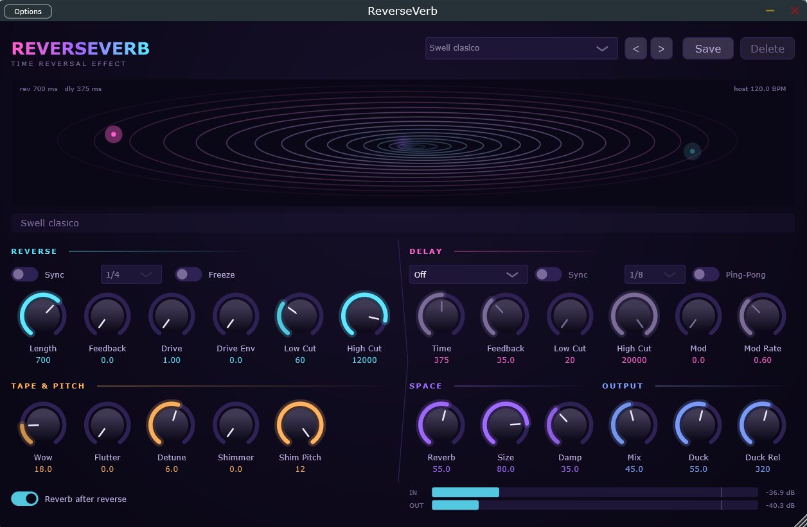

# ReverseVerb

**Reverse delay + delay + reverb para guitarra y cualquier otra fuente.**
Plugin VST3 para Windows, con versión Standalone para probarlo sin DAW.



Tocas una nota y, un instante después, la oyes crecer al revés: de la nada
hasta el ataque. Ese *swell* invertido es la base. Encima puedes ponerle un
delay rítmico, un reverb, textura de cinta (wow, flutter, desafinado), shimmer
de octavas y un ducking que aparta la cola mientras estás tocando para que no
te tape.

> Si vienes a **desarrollar** el plugin (compilar a fondo, tests, cómo funciona
> el DSP por dentro), todo eso está en [TECHNICAL.md](TECHNICAL.md). Este
> archivo es para **usarlo**.

---

## Índice

1. [Instalación](#instalación)
2. [Los primeros cinco minutos](#los-primeros-cinco-minutos)
3. [Los controles](#los-controles)
4. [Presets](#presets)
5. [Dónde ponerlo en tu cadena](#dónde-ponerlo-en-tu-cadena)
6. [La pantalla](#la-pantalla)
7. [Control por MIDI](#control-por-midi)
8. [Trucos y cosas que conviene saber](#trucos-y-cosas-que-conviene-saber)
9. [Problemas frecuentes](#problemas-frecuentes)

---

## Instalación

**Si hay una versión publicada** en
[Releases](https://github.com/cypherfunk-dev/ReverseVerb/releases), descarga
el zip de tu sistema, descomprímelo y salta a
[Cargarlo en Ableton Live](#cargarlo-en-ableton-live) (apuntando a la carpeta
donde dejaste el `.vst3`) o abre el Standalone directamente.

**Si no**, se compila desde el código. Solo hace falta hacerlo una vez.

**Necesitas:** Visual Studio (la edición Community gratuita vale) con el
paquete *"Desarrollo para escritorio con C++"* marcado durante la instalación,
y Git.

1. Abre el **Developer Command Prompt for VS** (búscalo en el menú Inicio).
2. Descarga el proyecto y compílalo:

```bat
git clone https://github.com/cypherfunk-dev/ReverseVerb.git
cd ReverseVerb
cmake -B build
cmake --build build --config Release
```

La primera vez tarda varios minutos porque descarga JUCE (unos 500 MB). Las
siguientes son rápidas.

Cuando termine tendrás dos cosas:

| Qué | Dónde |
|---|---|
| El plugin **VST3** | `build\ReverseVerb_artefacts\Release\VST3\ReverseVerb.vst3` |
| La versión **Standalone** (sin DAW) | `build\ReverseVerb_artefacts\Release\Standalone\ReverseVerb.exe` |

### Probarlo sin DAW

Abre el `ReverseVerb.exe` de arriba, ve a **Options → Audio Settings**, elige tu
interfaz de audio, y ya suena. Es la forma más rápida de probar el efecto y de
trastear con los presets.

### Cargarlo en Ableton Live

El plugin **no se copia solo** a la carpeta del sistema; en su lugar le dices a
Ableton que lo lea desde donde se ha compilado:

1. **Preferencias** (`Ctrl+,`) → pestaña **Plug-Ins**.
2. Activa **"Carpeta personalizada de plug-ins VST3"**.
3. **Examinar** → elige la carpeta
   `...\ReverseVerb\build\ReverseVerb_artefacts\Release\VST3`
   (la **carpeta**, no el archivo `.vst3`).
4. Pulsa **Volver a examinar**.

En otros DAW el proceso es el mismo: añade esa carpeta a las rutas de VST3 y
reescanea.

Si prefieres tenerlo en la carpeta estándar, copia `ReverseVerb.vst3` a
`C:\Program Files\Common Files\VST3` (te pedirá permisos de administrador).

---

## Los primeros cinco minutos

1. Carga el plugin en una pista con guitarra (o lo que sea).
2. Elige el preset **Swell clásico** en el desplegable de arriba.
3. Toca una nota suelta y déjala sonar. Oirás cómo aparece invertida un momento
   después.
4. Gira **Length**: es el tamaño del "trozo" que se invierte. Corto (100 ms)
   suena granular y nervioso; largo (1 s o más) es el swell ambiental.
5. Sube **Mix** para oír más efecto y menos guitarra directa.
6. Si al tocar frases rápidas la cola te tapa, sube **Duck**: el efecto se
   aparta mientras tocas y crece en los silencios.

Con eso ya tienes el 80 % del plugin. El resto son colores.

---

## Los controles

La pantalla está dividida en cinco bloques. Los nombres de los controles son
funcionales a propósito, para que los encuentres seis meses después.

### REVERSE — el motor principal

| Control | Qué hace |
|---|---|
| **Length** | Cuánto audio se invierte de cada vez (20 ms – 2 s). También es el retraso con el que oyes el efecto. Por debajo de 80 ms suena granular; a partir de 500 ms es el swell clásico. |
| **Sync** + división | En lugar de milisegundos, fija Length a una fracción del compás siguiendo el tempo del DAW. Hay puntillos y tresillos. |
| **Tempo** | Solo aparece cuando no hay DAW que mande el tempo (por ejemplo en el Standalone). Es el BPM que usan los dos Sync. |
| **Feedback** | Cuántas veces se repite la cola invertida. Hay un tope de seguridad interno (ver [Trucos](#trucos-y-cosas-que-conviene-saber)). |
| **Drive** | Saturación de la cola. Solo afecta a las repeticiones, no a la primera pasada, así que la cola se va "ensuciando" poco a poco, como en una cinta. |
| **Drive Env** | Hace que el Drive dependa de la fuerza con que tocas. A 0 el drive es fijo. Al subirlo, tocar suave deja la cola limpia y atacar fuerte la satura. |
| **Low Cut / High Cut** | Filtros dentro de la cola. El Low Cut es especialmente útil: quita graves que se acumulan repetición tras repetición. |
| **Freeze** | Congela lo que hay ahora mismo en el buffer y lo sostiene indefinidamente. Puedes seguir tocando encima sin que lo nuevo entre al congelado. Mientras está activo, Length y Feedback se desactivan. |

### DELAY — un delay estéreo normal, con su propio sitio en la cadena

| Control | Qué hace |
|---|---|
| **Ruteo** | Dónde va el delay respecto al reverse. Ver tabla abajo. |
| **Time / Sync / división** | Tiempo del delay, en ms o sincronizado al tempo. |
| **Feedback** | Repeticiones del delay. |
| **Low Cut / High Cut** | Filtros propios del delay. |
| **Ping-Pong** | Las repeticiones alternan izquierda y derecha. Solo funciona en pistas estéreo (en mono el botón se apaga). |
| **Mod / Rate** | Chorus suave en las repeticiones. Abre la imagen estéreo. |

| Ruteo | Cómo suena |
|---|---|
| **Off** | Delay desactivado. |
| **Delay → Rev** | Primero los ecos rítmicos, y cada eco se invierte. |
| **Rev → Delay** | El swell invertido completo se repite rítmicamente. El más "usable" de los tres. |
| **Paralelo** | Las dos cosas a la vez, sumadas. |

### TAPE — que suene a cinta

| Control | Qué hace |
|---|---|
| **Wow** | Deriva lenta de afinación. Es lo que hace que parezca un casete gastado. |
| **Flutter** | Temblor rápido de afinación. Más sutil; quita la sensación de "digital perfecto". |
| **Detune** | Desafina el canal izquierdo y el derecho en sentidos opuestos. Ensancha la imagen y da esa sensación mareadora de pared de sonido. |
| **Shimmer** | Parte de la cola pasa por un cambio de octava en cada repetición, así que se van apilando octavas por encima. |
| **Shim Pitch** | Cuántos semitonos sube (o baja) el shimmer, de −12 a +12. |

### SPACE — el reverb

| Control | Qué hace |
|---|---|
| **Reverb / Size / Damp** | Cantidad, tamaño de sala y oscuridad. A 0 el reverb está apagado y no consume nada. |
| **Reverb Post** | **Encendido**: el reverb va después del reverse; es el swell clásico que crece hacia la nota. **Apagado**: el reverb entra al buffer y se invierte con él; da un carácter de "succión" más raro. |

### OUTPUT

| Control | Qué hace |
|---|---|
| **Mix** | Balance entre señal directa y efecto. |
| **Duck** | Baja el efecto mientras hay señal de entrada. Es lo que hace usable un reverse reverb en una mezcla densa: la cola crece en los huecos en vez de tapar la nota que la provoca. Se adapta al nivel de tu señal, así que no depende de la ganancia de entrada. |
| **Duck Rel** | Con qué rapidez vuelve el efecto al dejar de tocar. Ajústalo al ritmo de la frase. |

---

## Presets

Vienen **24 de fábrica**, agrupados por intención. Aparecen tanto en el
desplegable del plugin como en el menú de presets de tu DAW.

| Grupo | Presets |
|---|---|
| Swells ambientales | Swell clásico · Nube lenta · Respiración |
| Rítmicos (sincronizados) | Swell al pulso · Tresillos invertidos · Corcheas cruzadas |
| Granulares | Granular metálico · Textura de vidrio · Motor roto |
| Sutiles, para mezcla | Profundidad discreta · Cola de voz |
| Referencias | Ref: Guthrie Wash · Ref: Bow & Swell · Ref: Greenwood Reverse · Ref: Dotted Edge |
| Shoegaze | Shoe: Muro · Shoe: Souvlaki · Shoe: Nowhere |
| Tape, shimmer y drive dinámico | Catedral (shimmer) · Octavas al pulso · Subterráneo · Cinta muerta · Dinámico (toca fuerte) · Drone (pulsa Freeze) |

Uno merece explicación: **Drone (pulsa Freeze)** no suena distinto de entrada.
Está *preparado* para congelar: ventana larga, shimmer moderado, reverb grande.
Tocas un acorde, pulsas Freeze, y sigues tocando encima del colchón.

### Los "Ref:"

Son puntos de partida inspirados en el **papel** que un reverse o un delay juega
en esos discos, no emulaciones. El sonido de una banda sale del instrumento, el
ampli, la sala y la mezcla; esto es un eslabón.

| Preset | De dónde sale la idea |
|---|---|
| **Ref: Guthrie Wash** | Cocteau Twins, Slowdive. Guitarra lavada hasta perder el ataque: ventana larga, reverb generoso, graves recortados, ping-pong para abrir la imagen. |
| **Ref: Bow & Swell** | Sigur Rós y post-rock en general. Ventana de 1.6 s, reverb enorme, ducking alto para que la nota respire antes de que llegue la cola. |
| **Ref: Greenwood Reverse** | Radiohead. Más corto, sincronizado y con saturación. Es el único de fábrica con **Reverb Post apagado**: de ahí sale ese carácter incómodo de succión. |
| **Ref: Dotted Edge** | U2. Aquí manda la sección DELAY con corchea con puntillo; el reverse queda en 120 ms como condimento. |

### Los "Shoe:"

| Preset | Idea |
|---|---|
| **Shoe: Muro** | El muro de sonido. Mix al 72 %, las dos ramas en paralelo, drive alto. El efecto pesa más que la señal directa, que es el punto. |
| **Shoe: Souvlaki** | Slowdive: vidrioso y largo. Ventana de 1.1 s, reverb al 82 %, poco damping para que brille. |
| **Shoe: Nowhere** | Ride: más empuje. Sincronizado a corcheas con el delay en semicorcheas. |

Dos cosas van **al revés** que en el resto, y es a propósito:

- **El Duck va bajo** (10–25 %). En shoegaze el desenfoque *es* la estética; un
  ducking alto te dejaría un efecto pulcro, justo lo contrario.
- **El Low Cut va alto** (150–250 Hz). Con el Mix por encima del 60 %, los
  graves se acumulan y el muro se vuelve barro. Es el control que separa
  "denso" de "sucio".

Aviso honesto: el sonido shoegaze sale sobre todo de reverb, modulación y
distorsión. El *glide* de My Bloody Valentine es la palanca de trémolo, que
este plugin no hace. Estos presets aportan la parte de cola invertida, que en
Cocteau Twins y Slowdive sí es un ingrediente real.

### Tus propios presets

Se guardan con el botón **Guardar** y viven en:

```
%APPDATA%\ReverseVerb\Presets\
```

Sobreviven a reinstalar el plugin y los puedes copiar a otro ordenador. Solo se
pueden borrar los tuyos; los de fábrica no.

---

## Dónde ponerlo en tu cadena

ReverseVerb es **un eslabón**, no una cadena. Con un ampli virtual (NAM y
similares), compresor y EQ, el orden que tiene sentido es:

```
Guitarra --> Ampli / NAM --> Compresor --> EQ --> ReverseVerb
```

- **Después del ampli**: quieres que el swell sea de *tu tono*, no que el
  ampli tenga que lidiar con una cola que crece al revés.
- **Después del compresor**: un compresor detrás bombearía contra los swells y
  desharía el ducking.
- **El EQ delante**, si arrastras graves sucios. Aunque el Low Cut de la cola ya
  ayuda bastante.

### Mono y estéreo

Funciona en pistas mono y estéreo, y también **de mono a estéreo**, que es el
caso típico de guitarra: entra una señal mono y a partir de aquí quieres
estéreo para que el ping-pong y la anchura tengan dónde actuar.

Si acabas en una pista mono de verdad, el botón Ping-Pong se apaga y arriba a
la derecha aparece un aviso `MONO`. En Ableton no lo verás nunca, porque
Ableton siempre pasa estéreo por la cadena de efectos.

### Guardar toda la cadena junta

Los presets del plugin solo guardan el plugin. Para guardar ampli + compresor +
EQ + ReverseVerb como una unidad, en Ableton usa un **Audio Effect Rack**: mete
todo dentro y guárdalo como preset de rack.

---

## La pantalla

La ambientación es de agujero de gusano, pero lo que se mueve **te está
contando algo**:

| Lo que ves | Lo que es |
|---|---|
| Las dos partículas que orbitan la boca del túnel | Los dos "granos" que leen el audio al revés. Su brillo es su volumen real. Se ven alternar y cruzarse. |
| La torsión del túnel | El Feedback del reverse. |
| El halo del núcleo | La cantidad de reverb. Se atenúa cuando el ducking actúa. |
| Los anillos que nacen y mueren | La ventana de cada grano: nada aparece de golpe. |

Los knobs van de **cian a magenta** según su valor, así que el color ya te
dice dónde están sin leer el número.

**Medidores** (abajo a la derecha): entrada y salida, de −48 a +6 dB, con
marca en 0 dB y el tramo por encima en ámbar. No es un limitador, es un aviso:
con feedback alto, shimmer y drive es fácil pasarse sin notarlo, porque las
colas largas suben despacio y el oído se acostumbra.

---

## Control por MIDI

Cualquier knob o botón se puede manejar con un pedal o controlador MIDI. Lo
que más sentido tiene en directo: **Freeze con un pedal**, **Mix con uno de
expresión**, y cambiar de preset con los botones de una pedalera.

### Asignar un control

1. **Clic derecho** sobre el knob o botón → **MIDI Learn**. La etiqueta pasa a
   decir `· learn...`.
2. Mueve el control físico (pisa el pedal, gira el knob). Queda asignado y la
   etiqueta muestra `· CC 64` (o el número que sea).
3. Para quitarlo: clic derecho → **Quitar CC n**.

Al asignar no se aplica el valor: si pisas un pedal para asignarlo a Freeze,
no se congela todavía.

### Freeze: momentáneo o toggle

Los botones (Freeze, Sync, Ping-Pong, Reverb Post) tienen dos modos, en el
mismo menú de clic derecho:

- **Momentáneo** (por defecto): el botón sigue al pedal. Con un pedal de
  sustain, *pisar = Freeze, soltar = suelta*. Es el modo bueno para tocar.
- **Toggle**: cada pulsación invierte. Para pedaleras que mandan un valor fijo
  en cada pisada.

### Presets desde una pedalera

Un mensaje **Program Change** carga el preset de fábrica con ese número
(0 = Swell clásico, 1 = Nube lenta… en el orden del desplegable).

### Tap tempo

Clic derecho sobre el control **Tempo** → **MIDI Learn (tap tempo)** y asigna
un botón. Cada pulsación cuenta; a partir de la segunda se fija el tempo con
la media de las últimas cuatro. Más de 2 s sin pulsar reinicia la cuenta.
Solo tiene efecto cuando no hay DAW que mande el tempo.

### Cómo le llega el MIDI en Ableton

Un efecto de audio no recibe MIDI directamente. En una **pista MIDI**, pon
tu controlador como entrada y en **MIDI To** elige la pista de audio donde
está ReverseVerb y, en el segundo desplegable, **ReverseVerb**. Arma la pista
MIDI (o activa el monitor en *In*).

Las asignaciones se guardan con el proyecto.

---

## Trucos y cosas que conviene saber

**Freeze es seguro; Feedback al máximo, no.** Freeze no es "feedback infinito":
es congelar el buffer y dejar de escribir en él, así que el nivel ni sube ni
baja. Para sustain infinito, usa Freeze.

**El Feedback del reverse tiene un tope interno del 60 %.** Por encima de ahí
el knob no hace más; es un límite de seguridad para que el lazo nunca se
dispare. Con **Shimmer** subido, el tope sube hasta el 70 %: el shimmer empuja
la energía hacia arriba en cada vuelta y esa energía se escapa, así que el lazo
es más estable. Resultado práctico: con Shimmer puedes subir el Feedback más y
la cola dura más. El delay convencional no tiene ese problema y su tope está
en el 95 %.

**Drive Env sigue tu pulsación de verdad.** Se calcula muestra a muestra, así
que reacciona al ataque, no un poco después.

**Shimmer no es un armonizador.** Tiene un pequeño error de afinación (±20
cents) que en un sonido shimmer no molesta porque ya es irreal por naturaleza.
Pero no lo uses esperando un intervalo afinado.

**En el Standalone el tempo lo pones tú.** Sin DAW nadie manda el BPM, así
que aparece un control **Tempo** junto a Freeze. En cuanto cargas el plugin en
un DAW, ese control desaparece y el visualizador muestra "host … BPM".

**Wow y Flutter se especifican en "cuánto desafina", no en tiempo.** Por eso
"Wow al 50 %" suena igual de desafinado a 44.1 kHz que a 96 kHz.

**El bypass del DAW deja que la cola se agote.** Al pulsar bypass en el host,
la señal directa pasa limpia y el efecto termina de sonar en vez de cortarse
de golpe.

**Cierra la ventana del plugin si sospechas de cortes.** El visualizador
repinta 30 veces por segundo. En máquinas justas eso compite con el audio. Con
la ventana cerrada no repinta nada.

---

## Problemas frecuentes

**Al recompilar dice `cannot open file ... ReverseVerb.vst3`.**
Ableton (o el DAW) tiene el plugin cargado y bloquea el archivo. Cierra el DAW
del todo; quitar el plugin de la pista no siempre lo libera.

**No aparece Windows ASIO en el Standalone, solo Windows Audio.**
Es normal: el SDK de ASIO no se puede incluir por licencia. Para probar este
efecto Windows Audio sobra (la latencia del driver es irrelevante con ventanas
de cientos de ms). Si lo quieres de todas formas, está explicado en
[TECHNICAL.md](TECHNICAL.md#asio).

**La cola sube de volumen sola y no para.**
No debería pasar: hay topes internos precisamente para eso. Si te ocurre, abre
un issue con el preset y los ajustes.

**El plugin se ha caído en el DAW.**
Antes de volver a cargarlo en un proyecto con trabajo, pruébalo en el
Standalone: si se cae ahí, cierras la ventana y ya; en un DAW puedes perder la
sesión y algunos ponen en lista negra los plugins que crashean.

---

## Para desarrolladores

Compilación a fondo, tests, validación con pluginval, cómo funciona cada motor
por dentro y las decisiones de diseño que no son obvias:
**[TECHNICAL.md](TECHNICAL.md)**.

Lo pendiente y lo descartado: **[BACKLOG.md](BACKLOG.md)**.
